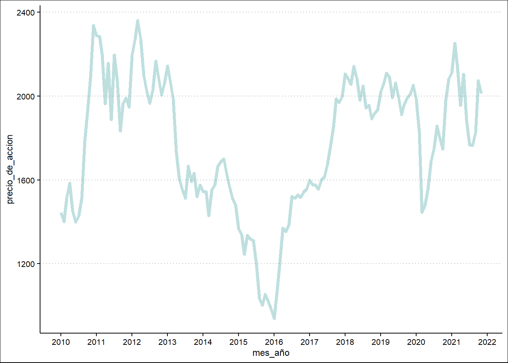
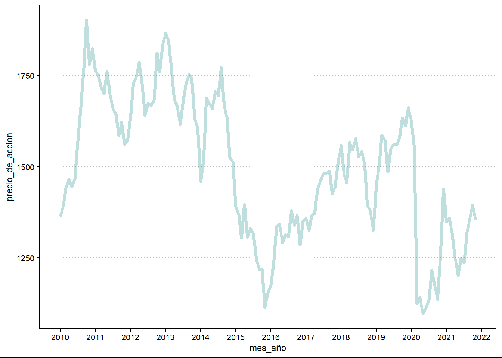

# Comportamiento del índice Bursatil de los paises de la Alianza del Pacífico {#bolsa-AP}

*Elvis Favian Caycho Villegas*

Matemático por la Universidad Nacional del Callao. Hizo una Maestría en Ciencia de la Educación Matemática por la Universidad Nacional Enrique Guzmán y Valle.
Maestría en estadística matemática por la Universidad Nacional Mayor de San Marcos.
Diplomado en investigación cuantitativa por la Universidad Nacional Enrique Guzmán y Valle.

## Introducción

La Alianza del Pacífico (AP) es una iniciativa multilateral latinoamericana constituida en el año 2011, orientada a promover la integración regional entre los cuatro países miembros (Colombia, Chile, México y Perú), en diversos frentes, incluyendo la integración de los sectores financieros y mercados de capitales. Como se indica  en www.smv.gob.pe

En ese sentido los indicadores del comportamiento bursatil pueden llegar a ser una medida bastante representativa acerca de la confianza que los inversionistas tienen en un país. Segun Urdaneta et al.(2021), "El análisis del comportamiento de los índices bursátiles, se constituye en información de fundamental importancia para comprender el contexto macroeconómico, como fundamento para delinear políticas económicas consistentes, que puedan dar respuesta a la situación de impacto socioeconómico, generado por la Pandemia de Covid–19"(p.727).

Como se puede explicar la caída catastrófica del mercado de valores estadounidense S&P 500 en el índice de precios de las acciones, luego de un mes de iniciado la noticia del 30 de enero al 19 de febrero del 2020, cayendo en un 34% para el  23 de marzo de 2020. Luego, a pesar del aumento de las noticias negativas en todo el mundo por el COVID-19, para el 30 de abril índice de precios de las acciones S&P 500 subió drásticamente en 30%, como es posible explicar este fenómeno (Schiller & Malkiel, 2020).

Ante el escenario de crisis sanitaria producto de la Covid-19, es necesario verificar el historial de la base de datos de los índices bursatiles de los cuatro paises que forman la Alianza del Pacífico en un tiempo razonable de la serie, de donde en la presente investigacion nos preguntamos, ¿Cuál es el comportamiento de los índices bursatiles de los paises dela Alianza del Pacifico del 2014-2021? 

## Paquetes usados
  
 Con el objetivo de emplear bases de datos, se utilizó el paquete tidyverse, 
dentro del cual tenemos, readr, la cual nos permitirá leer la informacion de la 
data con terminaciones CSV. Las siglas CSV vienen del inglés "Comma Separated Values" y significan valores separados por comas, haciendo una especie de tabla en filas y columnas que nos permite desarrollar una limpieza de datos, además de ejecutar funciones que ayudan con la organización, el filtrado y la selección de variables relevantes. Otro aporte de este paquete es que permite presentar la información extraída de la data a través de gráficos que pueden ser creados con la función ggplot.


```r
library(tidyverse)
library(janitor)
```


## Conjuntos de datos usados

### Lectura de datos

En este proyecto la base de datos fue extraído de la pagina [investing.com](https://es.investing.com/),  data histórica de los indices bursátiles de los países alianza del pacifico del 2010-2021.

Seguidamente se realiza una descripción del conjunto de datos ejecutados en relación a la pregunta general planteada:

Iniciamos con la descarga y guardado de nuestra base de datos; a partir de ello, procedimos a leerla a través de la función  read_csv().


```r
Bolsa_peru <- read_csv("data/BVL_Lima.csv") 

Bolsa_mexico<-read_csv("data/SPBMVIPC_mexico.csv") 

Bolsa_colombia<-read_csv("data/COLCAP_colombia.csv") 

Bolsa_chile<-read_csv("data/SPCLXIPSA_santiago.csv") 
```

Luego de explorar la base de datos,procedimos a explorar e identificar la información más relevante en tocante con el tema central. Al respecto, identificamos nuestras variables principales:

1. las fechas por mes y año: Date
2. El índice bursatil en puntos de miles de dolares: Price

Las variables identificadas permitirán responder a las siguientes preguntas:

- ¿Cual es el comportamiento del indices bursátil del Perú del 2014-2021?

- ¿Cual es el comportamiento del indices bursátil de México del 2014-2021?

- ¿Cual es el comportamiento del indices bursátil de Colombia del 2014-2021?

- ¿Cual es el comportamiento del indices bursátil de Chile del 2014-2021?

- ¿Cual es el comportamiento del indices bursátil de los países de alianza del pacifico del 2014-2021?

### Limpieza u ordenamiento de datos

En esta sección se presentan los códigos empleados para la obtención de la data que será usada en el análisis de resultados. 

Ejecutamos el código que permite obtener el valor de las etiquetas de datos provenientes de la extensión .csv. Seguidamente hacemos una limpieza de la data haciendo uso del paquete rename(),esta función nos permite cambiar el nombre de nuestras columnas. Debemos especificar:
El nombre del conjunto de datos
El cambio de nombre, usando la sintaxis nuevo_nombre = nombre_anterior.
Luego, Modificamos las variables de nuestro conjunto de datos con mutate(), pusto que la data original nos muestra desde la series actuales hasta las antiguas, pero para nuestra descripcion se necesitaba de las antiguas hasta le fecha actual, la cual se hizo dicho cambio con la funcion lubridate.

#### Comportamiento del índices bursatil del Perú del 2014-2021

El siguiente bloque de códigos, permite identificar la serie bursatil principal del Perú, Índice S&P/BVL Peru General - Bolsa de Valores de Lima. En los siguientes bloques de códigos, para tener la misma escala de índice bursatil que el resto de paises, se unificó la base de datos dividiendo a la varibles price por 10, obteniendose así:


```r
Bolsa_peru <- read_csv("data/BVL_Lima.csv") %>% 
    rename(mes_año = Date,
           precio_de_accion = Price) %>% 
    mutate(mes_año = lubridate::my(mes_año),
           bolsa = "Lima",precio_de_accion=precio_de_accion/10)
```

#### Comportamiento del índices bursatil de México del 2014-2021

El siguiente bloque de códigos, permite identificar la serie bursatil principal de México, El S&P/BMV Índice de Precios y Cotizaciones. En los siguientes bloques de códigos, para tener la misma escala de índice bursatil que el resto de paises, se unificó la base de datos dividiendo a la varibles price por 10, obteniendose así:


```r
Bolsa_mexico<-read_csv("data/SPBMVIPC_mexico.csv") %>% 
    rename(mes_año = Date,
           precio_de_accion = Price) %>% 
    mutate(mes_año = lubridate::my(mes_año),
           bolsa = "Mexico",precio_de_accion=precio_de_accion/10)
```

#### Comportamiento del índices bursatil de Colombia del 2014-2021

El siguiente bloque de códigos, permite identificar la serie bursatil principal de Colombia, COLCAP, obteniendose así:


```r
Bolsa_colombia<-read_csv("data/COLCAP_colombia.csv") %>% 
    rename(mes_año = Date,
           precio_de_accion = Price) %>% 
    mutate(mes_año = lubridate::my(mes_año),
           bolsa = "Colombia")
```

####  Comportamiento del índices bursatil de Chile del 2014-2021

El siguiente bloque de códigos, permite identificar la serie bursatil principal de Chile, IPSA (Índice de Precio Selectivo de Acciones) elaborado por la Bolsa de Comercio de Santiago, obteniendose así:


```r
Bolsa_chile<-read_csv("data/SPCLXIPSA_santiago.csv") %>% 
    rename(mes_año = Date,
           precio_de_accion = Price) %>% 
    mutate(mes_año = lubridate::my(mes_año),
           bolsa = "Chile")
```

####  Comportamiento del Índices bursatil de los paises de alianza del pacÍfico del          2014-2021

El siguiente bloque de códigos, permite identificar la serie bursatil principal unificado de los 4 paises de la Alianza del Pacífico con la columna, bolsa.


```r
bolsa_AP <- bind_rows(Bolsa_chile, Bolsa_peru, Bolsa_mexico, Bolsa_colombia)
```


## Resultados


### Gráfico de la serie historica del comportamiento del indices bursatil de Perú         del 2014-2021


```r

Bolsa_peru  %>%      
    ggplot(aes(mes_año, precio_de_accion)) + 
geom_line()
```



Observamos que en los años 2014 el Perú pasaba su peor momento de crisis alcanzando el minimo en los años 2016, luego del cual tuvo su acelerada crecimiento hasta el año 2018, luego del cual mantuvo un periode ciclico hasta el año 2020 donde tiene otra caida, producto de la crisis sanitaria.luego del cual se esta recuperando de forma rápida.


### Gráfico de la serie historica del comportamiento del indices bursatil de México del 2014-2021


```r
Bolsa_mexico %>% 
       ggplot(aes(mes_año, precio_de_accion)) + 
       geom_line()
```


Observamos que en los años 2014 México estaba en un momento bueno de crecimiento bursatil alcanzando su mejor momento en el año 2017, luego del cual tuvo su decrecimiento alcansando su caida total con la crisis sanitaria 2020.luego del cual se esta recuperando de forma rápida.

 

### Gráfico de la serie historica del comportamiento del indices bursatil de Colombia del 2014-2021


```r
Bolsa_colombia %>% 
      ggplot(aes(mes_año, precio_de_accion)) + 
      geom_line()
```



Observamos que en los años 2014 Colombia pasaba su peor momento de crisis alcanzando un piso minimo en los años  2016, luego del cual tuvo su acelerada crecimiento hasta el año 2018, luego del cual mantuvo un periode ciclico hasta el año 2020 donde tiene otra caida, producto de la crisis sanitaria, luego del cual se esta recuperando de forma lenta.


### Gráfico de la serie historica del comportamiento del indices bursatil de Chile del 2014-2021


```r
Bolsa_chile %>% 
        ggplot(aes(mes_año, precio_de_accion)) + 
        geom_line()
```


Observamos que en los años 2014 Chile pasaba momento de crecimiento lento, luego del cual tuvo una acelerado creciemiento a partir de los años 2016 alcanzando su pico  maximo en los años 2018, luego del cual comenso su caida terminando por completo el años 2020 producto de la crisis sanitaria, luego del cual se esta recuperando de forma lenta.


### Gráfico comparativo la serie historica del indices bursatil de los paises de alianza del pacifico del    2014-2021


```r
bolsa_AP %>% 
  ggplot(aes(mes_año, precio_de_accion, color = bolsa)) +
  geom_line() 
```


Observamos que los paises de Chile y México mantuvieron su indice bursatil muy parejos desde la integracion de la Alianza del Pacífico, además dichos paises superan a Perú y Colombia en índices bursatiles en aproximadamente 2000 puntos en los precios de sus acciones. Cabe notar que México tiene una mejor recuperación que Chile en su mercado. 

Por otro lado Perú y Colombia han mantenido muy similar en su índice bursatil, cabe notar que Perú tiene un mejor índice bursatil que colombia aun despues de la crisis sanitaria Covid-19.


## Conclusiones
 
 Perú ha tenido un indice bursatil en crecimiento desde el año 2016 mas aun de la caida  en crisis sanitaria muestra una clara garantia de atracción de las inversiones. 
México ha tenido un indice bursatil en crecimiento desde antes del 2014, antes de la crisis sanitaria mostró su caida, pero actualmente su economia se recupera muy satisfactoriamnte lo cual muestra claras garantias de un mercado confiable para las inversiones.

Colombia ha mantenido un índice bursatil irregular, casi constante en crecimiento lento con respecto a años anteriores a la crisis sanitaria, luego del cual se recupera con indice muy por debajo de sus puntos anterioes a la crisis, lo que muestra un mercado no muy confiable en las inversiones.

Por su parte Chile durante el tiempo de la comparacion desde los años 2014 de la Alianza del Pacifico, mostró los tres primeros años en un rapido crecimiento, luego del cual su caida también fue igual que su crecimeinto en sentido opuesto; mas aun luego de la crisis sanitaria, se recupera lentamente no llegando a su mejor momento, lo que muestra que tampoco no hay una clara garantia para las inversiones, pero viendo su historial es muy prematuro hablar de ello.

Se puede decir que de los 4 paises el que mejor posicionamiento que tiene con respecto a su mercado es México y Perú, más aun luego de la crisis sanitaria del Covid-19.

## Referencias

https://es.investing.com/indices/peru-indices?&majorIndices=on

Mercado Integrado Latinoamericano (MILA)
https://www.smv.gob.pe/Frm_VerArticulo?data=DAB6AC01F6A927D1C62B15955901AEA618CF29B1A8

Schiller, R., & Malkiel, B. (2020). Does Covid-19 prove the stock market is inefficient. Pairagraph. Available online at: https://www. pairagraph. com/dialogue/c93c449006c344ce94e6e2e8fbe7aba3.(Accessed August 05, 2020).

Urdaneta-Montiel, A. J., Segarra-Jaime, H. P., & Orellana-Intriago, F. R. (2021). Comportamiento de los índices bursátiles de las economías mundiales en el marco de la pandemia de covid–19. Dominio de las Ciencias, 7(1), 725-750.


